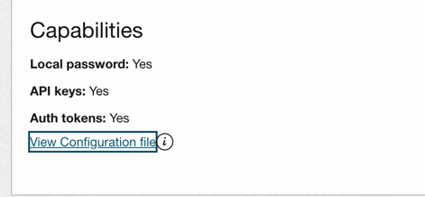

# Create an OCI Compute Instance  With Pulumi and Java.

This project uses Java and Pulumi CLI to create a Compute Instance on [Oracle Cloud Infrastructure (OCI)](https://cloud.oracle.com/en_US/cloud-infrastructure).

## Prerequisites
1. Download and install Pulumi CLI - https://www.pulumi.com/docs/get-started/install/
2. If not installed , download and install Java 21 or later - https://jdk.java.net/21/
3. OCI credentials to build the cluster

## How to run the project locally

Initialize your local setup with [`prepare.sh`](prepare.sh) script. This script does the following:

* Installs pulumi CLI if not already installed

* Creates a directory and login (the states of your stack will be saved locally):
  ```shell
  mkdir pulumi-state-local
  pulumi login file://pulumi-state-local
  ```

* Makes a new pulumi stack by running `https://github.com/ammbra/oci-vm-provider.git`.
When prompted for project name, use `oci-vm-provider` and use the default description.
Also, please use the stack name  `oci-vm-provider` in order to copy the settings provided.
You may choose to enter or keep an empty passphrase when asked.

* Executes `setup.sh` script that actually creates the infrastructure.

Finally, preview the stack using `pulumi preview`.

## Configuring credentials

To build your own Compute Instance, you should set its [secret configs](https://www.pulumi.com/registry/packages/oci/installation-configuration/).

The [`setup.sh`](setup.sh) script takes care of this for you 😀 but it asks you for a few details. 
You can find all of these values by going to the `Oracle Cloud Console` user interface and clicking the `Profile` menu and selecting your user (usually your email address).
In your profile you have an area named `Capabilities`, containing a link to a configuration file.
Click the link and copy the following values into the `setup.sh` prompt:

* `tenancy` to fulfill your tenancy OCID. 
* `user` for your userOcid
* `fingerprint` to fill in your oci fingerprint 



Your cluster will be deployed in a compartment inside OCI, so you should get `compartment_ocid`.
To get one of these ids, use the search provided by the `Oracle Cloud Console` user interface and type `compartment`.
Press enter, and you will receive all the compartments and associated OCIDs you are have been enabled.


Wait for a couple of minutes, and you will have a ready to work with OCI instance.

When you are done with your compute instance, you can delete the stack using `pulumi destroy `


 

